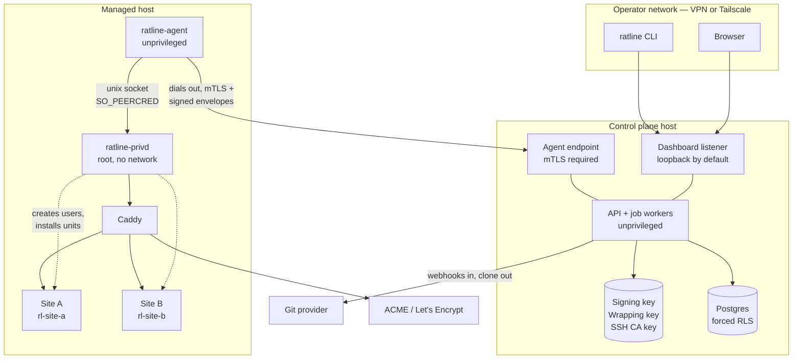
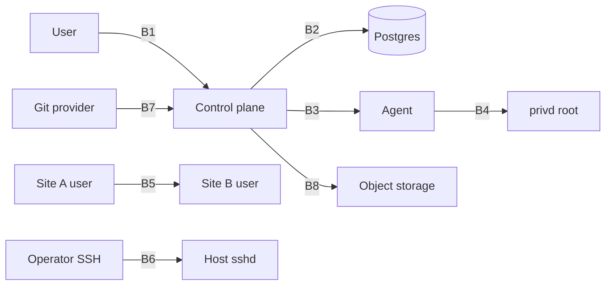
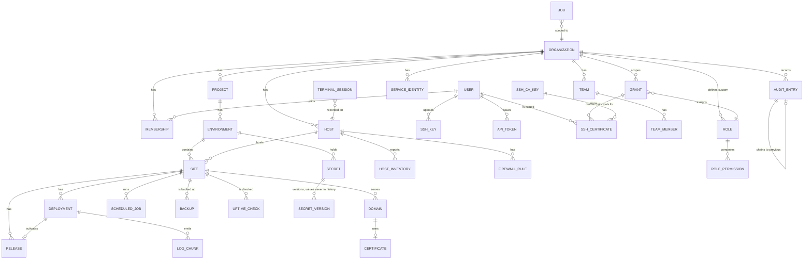
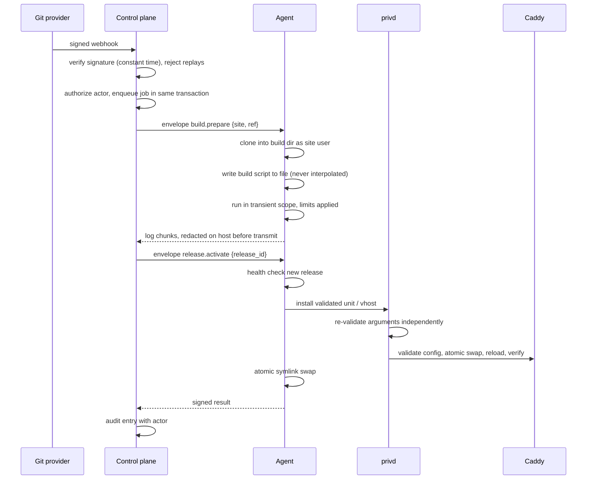

# Ratline — technical plan

**Status:** proposed, awaiting approval at the M0 gate
**Date:** 2026-08-01
**Task:** RL-M0-020
**Decisions:** ADR [0001](decisions/0001-stack-choice.md), [0002](decisions/0002-agent-transport-and-authentication.md), [0003](decisions/0003-tenant-scoping-and-data-access.md), [0004](decisions/0004-host-privilege-separation.md), [0009](decisions/0009-where-builds-run.md)

This is the architecture M1 starts from. It states component boundaries and
privilege levels, the data model through M6, every trust boundary and what
crosses it, and the repository layout — enough that M1 needs no further design.

---

## 1. Components and their privilege

| Component | Runs as | Holds | Reaches |
| --- | --- | --- | --- |
| **Control plane** | Unprivileged service user, on the operator's own machine or a VPS | Instruction signing key, secret-wrapping key, SSH authority key, database credentials | Postgres; outbound to Git providers, notification destinations, ACME |
| **Postgres** | Its own user | Everything tenant-scoped, under forced row-level security | Nothing outbound |
| **`ratline-agent`** | `ratline-agent`, unprivileged, one per host | Its client certificate, the control plane's public keys, active secret values for sites on this host | Outbound to the control plane; the `privd` socket; site directories |
| **`ratline-privd`** | `root`, socket-activated, **no network access at all** | Nothing persistent | Local filesystem, systemd, package manager, `visudo` |
| **Site process** | `rl-<site-slug>`, one user per site | Its own environment file | Whatever the application does |
| **`ratline` CLI** | The operator | A user API token | The control plane API |

Two properties do the heavy lifting:

- The control plane can only ask an agent for a **catalogued operation**. There
  is no operation that carries a command. (ADR 0002)
- The agent is **unprivileged**, and `privd` re-validates every argument
  independently rather than trusting it. So C1 holds against a compromised
  agent, not only against a compromised control plane. (ADR 0004)

### Deployment shape

The agent endpoint and the dashboard are **separate listeners with separate
exposure policies**. Agents must reach the control plane, but C5 says the
dashboard assumes it is not internet-exposed. So:

- **Dashboard** — binds to loopback by default. Reached over VPN, Tailscale or
  an address allowlist. Public reachability is detected and warned about loudly.
- **Agent endpoint** — may face the internet, requires a valid client
  certificate at the TLS handshake, and rejects everything else before any
  application code runs.

This distinction is easy for an operator to get wrong, so it must be the default
shape of the shipped configuration rather than a documentation footnote.

---

## 2. System diagram



Note the arrow direction on the agent link: **the host dials the control
plane.** No managed host listens on a Ratline port, which an integration test
asserts after provisioning (RL-M2-006).

---

## 3. Trust boundaries

Each boundary is a place where one side must not trust the other, and each has
a test that proves the distrust is real.



| # | Boundary | What crosses | What the trusting side must not assume | Proof |
| --- | --- | --- | --- | --- |
| **B1** | Browser / CLI → control plane | Session cookie or API token; form and API input | That the actor may see any resource they name. Authorization is resolved at the data layer, not here. | RL-M1-025 matrix, RL-M1-026 indistinguishability |
| **B2** | Control plane → Postgres | SQL, with a tenant set per transaction | That application predicates are present or correct. RLS holds independently. | RL-M1-006 — predicate removed, still zero rows |
| **B3** | Control plane → agent | Signed instruction envelopes over mTLS | That the channel implies authority. Signature, target, expiry and nonce are checked before any argument is read. | RL-M2-003, RL-M2-007 |
| **B4** | Agent → `privd` | Operation requests over a unix socket | **That the agent is honest.** `privd` re-validates every argument from scratch and identifies its caller by peer credentials. | RL-M2-008 — compromised agent cannot get arbitrary root |
| **B5** | Site user → site user | Nothing intended | That filesystem modes alone suffice. Per-site users plus systemd sandboxing plus directory modes. | RL-M3-006, RL-M6-005 |
| **B6** | Operator → host `sshd` | Short-lived certificate with principals | That a certificate implies current authorisation. Principals derive from live grants; revocation list and session termination back it up. | RL-M6-003 |
| **B7** | Git provider → control plane | Webhook deliveries | That a delivery is genuine. Signature verified in constant time **before** parsing; replays rejected. | RL-M3-002 |
| **B8** | Control plane / agent → object storage | Backup archives | That the endpoint is trusted with plaintext. Archives are encrypted before leaving the host. | RL-M4-013 |

B4 is the boundary that distinguishes this design from the incumbents. Without
it, C1 is a statement about SSH configuration; with it, C1 survives agent
compromise.

---

## 4. Data model

Tenant-scoped tables carry `org_id` and are covered by forced row-level
security. `scope_path` on hierarchy nodes is materialised so an inheriting
permission check resolves in one indexed query (ADR 0003).



### Notes on specific entities

**`GRANT`** carries `subject_type` (user, service identity, API token),
`subject_id`, `role_id`, `scope_type`, `scope_id`, `expires_at`, `granted_by`
and `reason`. Denies share the shape with `effect: deny` and always win.
`expires_at` is evaluated **at decision time and in the SQL predicate**, so an
expired grant is dead the instant it expires — no cleanup job is in the
enforcement path (§6.3). A cleanup job exists only for hygiene.

**`SECRET` / `SECRET_VERSION`** — the name is plaintext so `secret.read_name`
works without unwrapping. The value is sealed under a per-secret data key, itself
wrapped by the key-encryption key. `SECRET_VERSION` records actor and timestamp
and **never the value**, including in audit metadata (ADR 0006).

**`AUDIT_ENTRY`** — append-only, enforced at the database level rather than by
convention: update and delete are refused outright. Each entry chains to its
predecessor by hash. Records actor, action, resource, decision, address,
timestamp and request identifier. Denied decisions are recorded as
prominently as allowed ones.

**`RELEASE`** — directory names are system-generated timestamps, never derived
from user input (RL-M3-008).

**`HOST`** stores the agent's public key and certificate serial, so revocation
is a row update.

**`JOB`** is a queue row (ADR 0007), tenant-scoped like everything else, so a
worker cannot claim a job it could not read.

---

## 5. Authorization resolution

One function decides everything: `can(actor, action, resource, context)`.

```
1. Resolve the actor's effective grants for the resource's scope path,
   filtered by expiry in SQL — expired rows never load.
2. If any DENY matches the action at any scope, deny. Denies always win.
3. If any GRANT's role includes the action, allow.
4. Otherwise deny. An unmapped action is a denial.
```

An API token's permissions are intersected with its issuing user's **at use
time**, not only at issue time, so downgrading the user immediately downgrades
the token (RL-M1-032).

Break-glass elevation is a time-bound grant with a mandatory reason that
notifies every Owner and is visible in the interface for its duration
(RL-M5-003) — it uses the same machinery, not a bypass.

The role editor's live preview calls **this same function**, never a
reimplementation; RL-M5-004 tests parity explicitly, because a preview that
disagrees with enforcement is worse than no preview.

---

## 6. Deployment pipeline



Failure at any step leaves the previous release serving. Rollback is a symlink
swap measured under one second (RL-M3-010). The whole sequence is idempotent and
resumable, and RL-M2-026 kills the connection at randomised points to prove it.

---

## 7. Repository layout

```
src/
  db/
    internal/          # the ONLY module that constructs the Drizzle client
                       # exports scoped() and nothing else
    migrations/        # plain SQL, every one with a tested down path
  repo/                # the only importer of db/internal
                       # every function takes AuthzContext first
  authz/               # can(), permission catalogue, roles, grant resolution
                       # 100% line and branch coverage enforced in CI
  auth/                # passwords and sessions (ADR 0014). Holds no database
                       # handle — its queries live in src/repo/sessions.ts
  api/                 # Hono routes; declare required action, hold no permission logic
  jobs/                # queue workers
  crypto/              # envelope encryption, signing, key loading
  ops/                 # operation catalogue — the single schema both sides generate from
  web/                 # SvelteKit app
    lib/design/        # tokens from DESIGN.md; no hard-coded colour anywhere else
agent/
  cmd/ratline-agent/
  cmd/ratline-privd/
  internal/
    ops/               # generated from src/ops
    webserver/         # templates + escapers (ADR 0010)
    runtime/           # mise, pinned runtimes
    sandbox/           # transient scopes, limits
test/
  authz/               # matrix, roles, grants, coverage gate
  security/            # injection, traversal, cross-tenant, leakage, replay
  integration/         # real hosts only — nothing mocked
docs/                  # tracking artifacts (brief §2)
scripts/tasks.ts       # tracking CLI
```

The layout encodes the constraints: `db/internal` is import-restricted by lint
(RL-M1-008); `authz/` is the only place permission logic exists; `ops/` is the
single source both sides generate from, so control plane and agent cannot drift.

---

## 8. What M1 starts with

In order, with dependencies already encoded in `tasks.yaml`:

1. `RL-M1-001` — scaffold, strict TypeScript, lint
2. `RL-M1-002` — CI, with `tasks validate` gating the build
3. `RL-M1-003` → `RL-M1-007` — migrations, identity, hierarchy, RLS, scoped access
4. `RL-M1-008` — the lint rules that make the forbidden patterns unwritable
5. `RL-M1-009` → `RL-M1-013` — catalogue, roles, grants, `can()`, coverage gate
6. `RL-M1-014` → `RL-M1-016` — audit chain and attribution
7. `RL-M1-017` → `RL-M1-023` — sessions, 2FA, rate limits, CSRF, C4, C5
8. `RL-M1-024` → `RL-M1-026` — matrix generator, harness, indistinguishability
9. `RL-M1-027` → `RL-M1-031` — design tokens, shell, palette, onboarding, audit viewer

`./scripts/tasks next --milestone M1` prints what is ready at any point.

---

## 9. Open questions

Carried into the M0 gate report rather than resolved here:

1. **Integration test hosts.** §6.7 forbids mocking anything touching a host.
   The development machine has Docker but no VM tooling, and containers cannot
   faithfully exercise the systemd sandboxing M2 depends on. This blocks the M2
   exit criteria and needs either cloud credentials or a local VM tool.
2. **C2 versus user-authored build commands.** Raised as a §2.10 stop condition
   in ADR 0005, which proposes containment rather than elimination.
3. **Front-end framework.** SvelteKit recommended in ADR 0001, but the team's
   existing skill set should decide it.
4. **SAML.** Listed in §6.3 but absent from the M5 exit criteria. Large. Tracked
   as `RL-M5-006`.
5. **Preview environments.** Allowed by §6.5 "if it doesn't blow the milestone".
   Tracked as an explicit decision point, `RL-M3-027`.
6. **Managed databases** were requested after M0 and are planned as M7
   (ADR 0013), which amends brief §5.2. Whether they are v1 scope or follow v1
   is open. They are the first workload Ratline would manage that cannot be
   reconstructed from git, which changes the failure story for the whole
   product — recorded as R-14.
